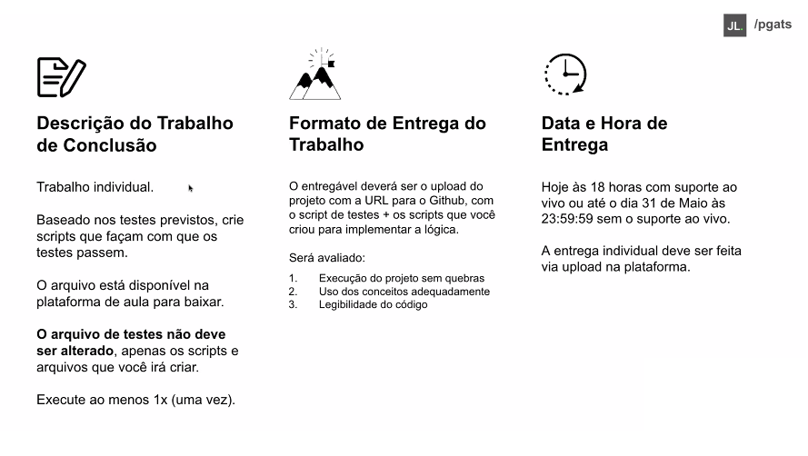
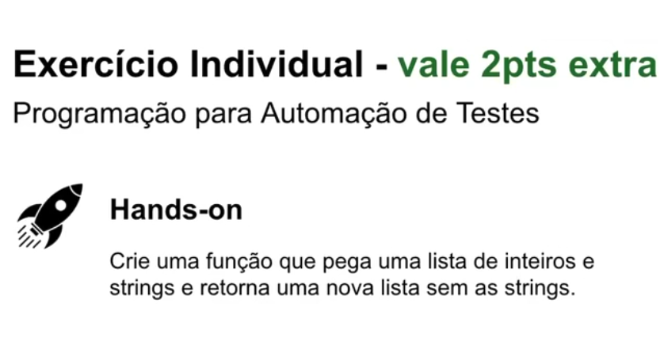

# Trabalho Final do Dennys Müller - Fundamentos de JavaScript

&nbsp;&nbsp;&nbsp;Este projeto consiste na implementação de funções em JavaScript para resolver problemas relacionados ao gerenciamento de
informações de animais em um abrigo. Os testes para as funções estão no arquivo `trabalho-final.js`, e as implementações das funções estão no arquivo `trabalho.js`.


## Explicação Detalhada das Funções:

1.  **`geradorDeTagsDeIdentificacao(nome)`:**

    ```javascript
    const geradorDeTagsDeIdentificacao = (nome) => {
      return nome.toUpperCase();
    };
    ```

    * Recebe o `nome` do animal como entrada.
    * Converte o `nome` para letras maiúsculas usando `toUpperCase()`.
    * Retorna o nome em maiúsculas.

2.  **`verificarSePodeSerAdotado(idade, porte)`:**

    ```javascript
    const verificarSePodeSerAdotado = (idade, porte) => {
      return idade >= 1 && (porte === 'M' || porte === 'G');
    };
    ```

    * Recebe a `idade` e o `porte` do animal como entrada.
    * Verifica se a `idade` é maior ou igual a 1 **E** se o `porte` é 'M' ou 'G'.
    * Retorna `true` se ambas as condições forem verdadeiras, caso contrário, retorna `false`.

3.  **`calcularConsumoDeRacao(nome, idade, peso)`:**

    ```javascript
    const calcularConsumoDeRacao = (nome, idade, peso) => {
      return peso * 30 * 10;
    };
    ```

    * Recebe o `nome`, `idade` e `peso` do animal como entrada.
    * Calcula o consumo diário de ração multiplicando o `peso` por 30 e depois por 10.
    * Retorna o consumo em gramas.

4.  **`decidirTipoDeAtividadePorPorte(porte)`:**

    ```javascript
    const decidirTipoDeAtividadePorPorte = (porte) => {
      if (porte === 'pequeno') {
        return 'brincar dentro de casa';
      } else if (porte === 'medio') {
        return 'passear no parque';
      } else if (porte === 'grande') {
        return 'correr em campo aberto';
      }
    };
    ```

    * Recebe o `porte` do animal como entrada.
    * Usa uma estrutura `if-else if` para determinar a atividade apropriada com base no porte:
        * 'pequeno' -\> 'brincar dentro de casa'
        * 'medio'   -\> 'passear no parque'
        * 'grande'  -\> 'correr em campo aberto'
    * Retorna a string com a atividade.

5.  **`buscarDadoAsync()`:**

    ```javascript
    const buscarDadoAsync = () => {
      return new Promise((resolve) => {
        setTimeout(() => {
          resolve('Pipoca');
        }, 100); // Um delay de 100ms para simular a assincronicidade
      });
    };
    ```

    * Não recebe nenhum parâmetro.
    * Cria uma nova `Promise`.
    * Dentro da `Promise`, usa `setTimeout` para simular um atraso de 100 milissegundos (0.1 segundo).
    * Após o atraso, a `Promise` é resolvida (`resolve`) com o valor "Pipoca".
    * Retorna a `Promise`.

## Como Executar os Testes (Localmente - Necessário Node.js instalado):

1.  **Certifique-se de ter o Node.js instalado.**
2.  **Salve os arquivos:**
    * `trabalho-final.js` (arquivo de testes)
    * `trabalho.js` (arquivo com as funções)
    * Coloque ambos no mesmo diretório.
3.  **Execute os testes usando o Mocha:**

    ```bash
    npx mocha Final/Testes/trabalho-final.js
    ```

    * Isso executará os testes definidos em `trabalho-final.js`. Os resultados serão exibidos no terminal.
    

## Observações Importantes:

* **`import assert from 'node:assert';`**:  Esta linha no `trabalho-final.js` importa o módulo `assert` do Node.js, usado para escrever os testes.
* **`export` / `import`**: As funções em `trabalho.js` são exportadas e importadas para que o arquivo de teste possa usá-las.
* **`describe` e `it`**:  Funções do framework de testes (Mocha neste caso) para organizar os testes.
* **`assert.strictEqual()`**:  Função para verificar se dois valores são estritamente iguais.
* **`Promise`** é um objeto usado para lidar com operações assíncronas, como requisições a APIs, leitura de arquivos, etc.
  - Uma **Promise** representa um valor que pode estar disponível agora, no futuro ou nunca. Ela tem três estados:
  - __Pendente (pending):__ A operação ainda está em andamento.
  - __Resolvida (fulfilled):__ A operação foi concluída com sucesso.
  - __Rejeitada (rejected):__ A operação falhou.
* **`async` / `await`**: Usados para lidar com a função assíncrona `buscarDadoAsync()`.
---
# Trabalhos extras

Este repositório contém duas funções JavaScript para realizar tarefas específicas:

1.  Filtrar uma lista de números e strings.
2.  Contar o número de vogais em uma string.

## 1. Função `filtrarInteiros`

### Descrição

A função `filtrarInteiros` recebe uma lista que pode conter números inteiros e strings, e retorna uma nova lista contendo apenas os números inteiros.


### Código

```javascript
function filtrarInteiros(lista) {
  const novaLista = [];
  for (let i = 0; i < lista.length; i++) {
    const elemento = lista[i];
    if (typeof elemento === 'number') {
      novaLista.push(elemento);
    }
  }
  return novaLista;
}

# Função `contarVogais`

## Descrição

A função `contarVogais` recebe uma string como entrada e retorna o número total de vogais (a, e, i, o, u) presentes na string. A string de entrada deve conter apenas letras minúsculas e/ou espaços. Letras acentuadas não são consideradas.


## Código

```javascript
function contarVogais(texto) {
  let contadorVogais = 0;
  const vogais = ['a', 'e', 'i', 'o', 'u'];
  for (let i = 0; i < texto.length; i++) {
    const caractere = texto[i];
    if (vogais.includes(caractere)) {
      contadorVogais++;
    }
  }
  return contadorVogais;
}

---
🔗 Saiba mais em [PGATS](https://pgats.com.br/)