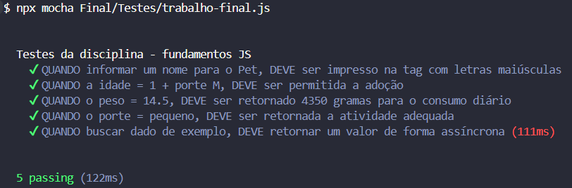

# Trabalho Final - Fundamentos de JavaScript

Este projeto consiste na implementação de funções em JavaScript para resolver problemas relacionados ao gerenciamento de informações de animais em um abrigo. Os testes para as funções estão no arquivo `trabalho-final.js`, e as implementações das funções estão no arquivo `trabalho.js`.

## Explicação Detalhada das Funções:

1.  **`geradorDeTagsDeIdentificacao(nome)`:**

    ```javascript
    const geradorDeTagsDeIdentificacao = (nome) => {
      return nome.toUpperCase();
    };
    ```

    * Recebe o `nome` do animal como entrada.
    * Converte o `nome` para letras maiúsculas usando `toUpperCase()`.
    * Retorna o nome em maiúsculas.

2.  **`verificarSePodeSerAdotado(idade, porte)`:**

    ```javascript
    const verificarSePodeSerAdotado = (idade, porte) => {
      return idade >= 1 && (porte === 'M' || porte === 'G');
    };
    ```

    * Recebe a `idade` e o `porte` do animal como entrada.
    * Verifica se a `idade` é maior ou igual a 1 **E** se o `porte` é 'M' ou 'G'.
    * Retorna `true` se ambas as condições forem verdadeiras, caso contrário, retorna `false`.

3.  **`calcularConsumoDeRacao(nome, idade, peso)`:**

    ```javascript
    const calcularConsumoDeRacao = (nome, idade, peso) => {
      return peso * 30 * 10;
    };
    ```

    * Recebe o `nome`, `idade` e `peso` do animal como entrada.
    * Calcula o consumo diário de ração multiplicando o `peso` por 30 e depois por 10.
    * Retorna o consumo em gramas.

4.  **`decidirTipoDeAtividadePorPorte(porte)`:**

    ```javascript
    const decidirTipoDeAtividadePorPorte = (porte) => {
      if (porte === 'pequeno') {
        return 'brincar dentro de casa';
      } else if (porte === 'medio') {
        return 'passear no parque';
      } else if (porte === 'grande') {
        return 'correr em campo aberto';
      }
    };
    ```

    * Recebe o `porte` do animal como entrada.
    * Usa uma estrutura `if-else if-else` para determinar a atividade apropriada com base no porte:
        * 'pequeno' -\> 'brincar dentro de casa'
        * 'medio'   -\> 'passear no parque'
        * 'grande'  -\> 'correr em campo aberto'
    * Retorna a string com a atividade.

5.  **`buscarDadoAsync()`:**

    ```javascript
    const buscarDadoAsync = () => {
      return new Promise((resolve) => {
        setTimeout(() => {
          resolve('Pipoca');
        }, 100); // Um delay de 100ms para simular a assincronicidade
      });
    };
    ```

    * Não recebe nenhum parâmetro.
    * Cria uma nova `Promise`.
    * Dentro da `Promise`, usa `setTimeout` para simular um atraso de 100 milissegundos (0.1 segundo).
    * Após o atraso, a `Promise` é resolvida (`resolve`) com o valor "Pipoca".
    * Retorna a `Promise`.

## Como Executar os Testes (Localmente - Necessário Node.js instalado):

1.  **Certifique-se de ter o Node.js instalado.**
2.  **Salve os arquivos:**
    * `trabalho-final.js` (arquivo de testes)
    * `trabalho.js` (arquivo com as funções)
    * Coloque ambos no mesmo diretório.
3.  **Execute os testes usando o Mocha:**

    ```bash
    npx mocha Final/Testes/trabalho-final.js
    ```

    * Isso executará os testes definidos em `trabalho-final.js`.
    

## Observações Importantes:

* **`import assert from 'node:assert';`**:  Esta linha no `trabalho-final.js` importa o módulo `assert` do Node.js, usado para escrever os testes.
* **`export` / `import`**: As funções em `trabalho.js` são exportadas e importadas para que o arquivo de teste possa usá-las.
* **`describe` e `it`**:  Funções do framework de testes (Mocha neste caso) para organizar os testes.
* **`assert.strictEqual()`**:  Função para verificar se dois valores são estritamente iguais.
* **`async` / `await`**: Usados para lidar com a função assíncrona `buscarDadoAsync()`.